# WellMate Health Assistant System

## Overview

**WellMate** is a comprehensive health assistant system that integrates physical health monitoring and mental wellness support. The system provides intelligent health consultation services through AI-powered agents, supporting both mental health counseling and physical health guidance.

*Note: This repository was originally the backend repository. The frontend application was migrated from [https://github.com/Mint-green/WellMate-App.git](https://github.com/Mint-green/WellMate-App.git) and the agent services were migrated from [https://github.com/mooooohan/Health-Agent.git](https://github.com/mooooohan/Health-Agent.git).*

## System Architecture & Technology Stack

WellMate adopts a microservices architecture with the following core components and technology stack:

### Architecture Diagram

```mermaid
flowchart TD
    %% First Layer: Client App at the top
    A[📱 <b style="font-size:1.2em">WellMate Client App</b><br/>User Authentication, Health Chat Interface, Data Visualization & Management]
    
    %% Second Layer: Backend and MySQL on the same level
    B[🚀 <b style="font-size:1.2em">Python Backend Service</b><br/>API Gateway, Authentication, Session & AI Integration]
    D[💾 <b style="font-size:1.2em">MySQL Database</b><br/>User Data & Chat History]
    
    %% Third Layer: Language-Bind, Physical Agent and Mental Agent on the same level
    C[🔤 <b style="font-size:1.2em">Language-Bind Service</b><br/>Mood Analysis & Data Tagging]
    E1[💪 <b style="font-size:1.2em">Physical Health Agent</b><br/>Physical Health Advice<br/>Exercise & Diet Recommendations]
    E2[🧠 <b style="font-size:1.2em">Mental Health Agent</b><br/>Emotional Support<br/>Psychological Counseling]
    
    %% Style definitions
    classDef client fill:#e3f2fd,stroke:#1976d2
    classDef backend fill:#e8f5e8,stroke:#388e3c
    classDef database fill:#fff3e0,stroke:#f57c00
    classDef external fill:#fce4ec,stroke:#c2185b
    
    class A client
    class B,C backend
    class D database
    class E1,E2 external
    
    %% Data flow arrows
    A -->|API Request| B
    B <-->|Data Operations| D
    B <-->|Data Pre-Processing| C
    B -->|Health Consultation| E1
    B -->|Mental Support| E2
```



**Data Flow Sequence:**
1. **Client Request**: WellMate App sends REST API requests to Python backend
2. **Authentication**: Backend validates JWT tokens and user permissions
3. **Database Operations**: Backend performs CRUD operations on MySQL database
4. **Data Pre-processing**: Backend sends data to Language-Bind service for multimodal data recognition and tagging (optional)
5. **AI Service Integration**: Backend calls appropriate Coze agents based on health domain, using pre-processed data if available
6. **Response**: Processed results returned to client through backend

**Language-Bind Service Functionality:**
- **Multimodal Data Recognition**: Text, audio, and image data processing
- **Emotion Analysis**: Mood detection and emotional state classification  
- **Data Tagging**: Automatic labeling and categorization of health data
- **Pre-processing Pipeline**: Data cleaning, normalization, and feature extraction

### Frontend Application
- **Technology Stack**: uni-app x framework + TypeScript (UTS)
- **Platform**: Cross-platform mobile application (iOS, Android, Web)
- **Core Features**: 
  - User authentication and profile management
  - Health conversation interface with AI assistants
  - Health data visualization and management
  - Session history management
  - Multi-language support (English/Chinese)

### Backend Service
- **Technology Stack**: Flask + Gunicorn + Python 3.11+
- **Deployment**: Docker containerized deployment
- **Core Features**:
  - RESTful API gateway and JWT authentication
  - Session and conversation management
  - AI service integration and routing
  - Database operations and data persistence

### AI Service Agents

#### Mental Health Agent
- **Service**: Professional mental health and emotional support
- **Technology Stack**: FastAPI + Coze platform AI agent
- **Features**: Emotional counseling, psychological support, stress management, emotional analysis

#### Physical Health Agent  
- **Service**: Physical health consultation and advice
- **Technology Stack**: Coze platform AI agent
- **Features**: Exercise recommendations, dietary guidance, body metrics analysis

#### Language-Bind Service
- **Service**: Advanced text processing and emotional analysis
- **Technology Stack**: Custom multimodal AI processing
- **Features**: Emotion recognition, data tagging, classification

### Database & Infrastructure
- **Database**: MySQL 8.0 (Docker container)
- **Container Runtime**: Docker
- **Orchestration**: Docker container management scripts (individual service management)
- **Monitoring**: Application logging
- **Deployment**: CI/CD pipeline

## Core Features

### 🤖 Intelligent Health Consultation
- AI-driven health conversations with professional agents
- Support for both physical and mental health topics
- Context-aware conversation management
- Real-time streaming responses

### 💬 Session Management
- Automatic session creation and management
- Complete conversation history storage
- Session recovery and continuity support
- Multi-device session synchronization

### 📊 Health Data Management
- Comprehensive health metrics tracking
- Data visualization and analysis
- Privacy-focused data storage
- Cross-platform data synchronization

### 🔐 Security & Authentication
- JWT-based token authentication
- Secure password hashing
- Role-based access control
- Encrypted data transmission

### 🌐 Multi-language Support
- Support for English and Chinese
- Automatic language detection
- Localized user interface
- Cultural adaptation

## Project Structure

```
WellMate/
├── backend/                 # Python Flask backend service
├── frontend-app/            # uni-app x frontend application
├── mental_agent/            # Mental health AI service agent
├── physical_agent/          # Physical health AI service agent
├── LanguageBind+Audio_to_text/  # Training code and models
├── README.md                # Project documentation (English)
└── README_zh.md             # Project documentation (Chinese)
```

## Prerequisites
- Python 3.11+
- MySQL 8.0+
- Docker 20.10+ (optional)
- Node.js (for frontend development)

