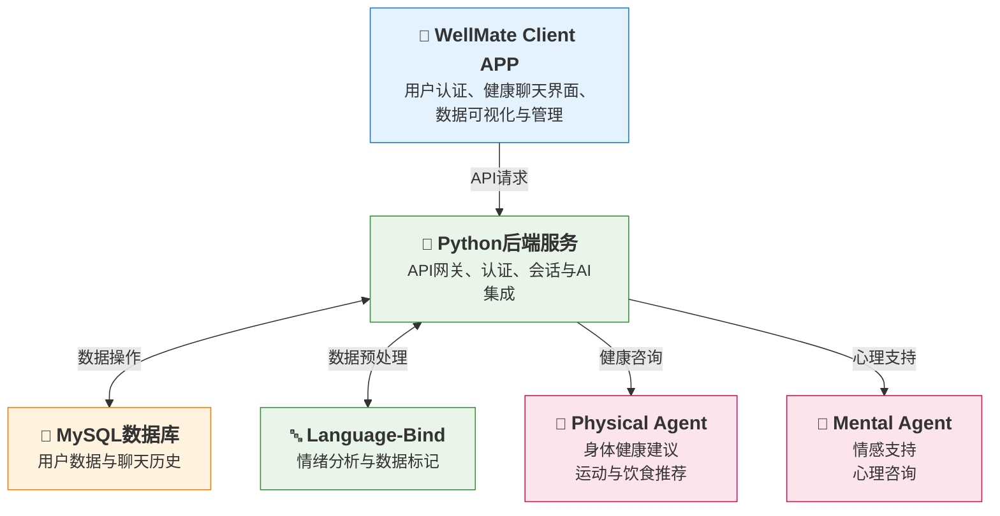

# WellMate 健康助手系统

## 项目概述

**WellMate** 是一个综合性健康助手系统，集成了身体健康监测和心理健康支持服务。该系统通过统一的移动应用界面，提供AI驱动的健康咨询、情绪支持和数据管理功能。

*注意：本仓库原为后端仓库，前端应用迁移自 [https://github.com/Mint-green/WellMate-App.git](https://github.com/Mint-green/WellMate-App.git)，Agent服务迁移自 [https://github.com/mooooohan/Health-Agent.git](https://github.com/mooooohan/Health-Agent.git)。*

## 系统架构与技术栈

WellMate 采用微服务架构，包含以下核心组件和技术栈：

### 架构图



**数据流序列：**
1. **客户端请求**：WellMate应用向Python后端发送REST API请求
2. **认证验证**：后端验证JWT令牌和用户权限
3. **数据库操作**：后端对MySQL数据库执行CRUD操作
4. **数据预处理**：后端将数据发送至Language-Bind服务进行多模态数据识别和标记（可选）
5. **AI服务集成**：后端根据健康领域调用相应的Coze代理，使用预处理后的数据（如可用）
6. **响应返回**：处理结果通过后端返回给客户端

**Language-Bind服务功能：**
- **多模态数据识别**：文本、音频和图像数据处理
- **情绪分析**：情绪检测和情感状态分类
- **数据标记**：健康数据的自动标记和分类
- **预处理管道**：数据清洗、标准化和特征提取

### 前端应用
- **技术栈**: uni-app x 框架 + TypeScript (UTS)
- **平台**: 跨平台移动应用 (iOS, Android, Web)
- **核心功能**: 
  - 用户认证和个人资料管理
  - 与AI助手进行健康对话的界面
  - 健康数据可视化管理
  - 会话历史记录管理
  - 多语言支持 (英文/中文)

### 后端服务
- **技术栈**: Flask + Gunicorn + Python 3.11+
- **部署方式**: Docker 容器化部署
- **核心功能**:
  - RESTful API 网关和JWT认证
  - 会话和对话管理
  - AI 服务集成和路由
  - 数据库操作和数据持久化

### AI 服务代理

#### 心理健康代理
- **服务**: 专业的心理健康和情绪支持
- **技术栈**: FastAPI + Coze 平台AI代理
- **功能**: 情绪咨询、心理支持、压力管理、情绪分析

#### 身体健康代理  
- **服务**: 身体健康咨询和建议
- **技术栈**: Coze 平台AI代理
- **功能**: 运动建议、饮食指导、身体指标分析

#### Language-Bind 服务
- **服务**: 高级文本处理和情绪分析
- **技术栈**: 自定义多模态AI处理
- **功能**: 情绪识别、数据标记、分类

### 数据库与基础设施
- **数据库**: MySQL 8.0 (Docker 容器)
- **容器运行时**: Docker
- **编排**: Docker容器管理脚本（独立服务管理）
- **监控**: 应用日志记录
- **部署**: CI/CD 流水线

## 核心功能

### 🤖 智能健康咨询
- AI驱动的健康对话，支持专业代理
- 同时支持身体健康和心理健康话题
- 上下文感知的对话管理
- 实时流式响应

### 💬 会话管理
- 自动会话创建和管理
- 完整的对话历史记录存储
- 会话恢复和连续性支持
- 多设备会话同步

### 📊 健康数据管理
- 全面的健康指标跟踪
- 数据可视化和分析
- 注重隐私的数据存储
- 跨平台数据同步

### 🔐 安全与认证
- 基于JWT的令牌认证
- 安全密码哈希
- 基于角色的访问控制
- 加密数据传输

### 🌐 多语言支持
- 支持英文和中文
- 自动语言检测
- 本地化用户界面
- 文化适配

## 项目结构

```
WellMate/
├── backend/                 # Python Flask后端服务
├── frontend-app/            # uni-app x前端应用
├── mental_agent/            # 心理健康AI服务代理
├── physical_agent/          # 身体健康AI服务代理
├── LanguageBind+Audio_to_text/  # 训练代码和模型
├── README.md                # 项目文档（英文版）
└── README_zh.md             # 项目文档（中文版）
```

## 环境要求
- Python 3.11+
- MySQL 8.0+
- Docker 20.10+ (可选)
- Node.js (前端开发需要)

